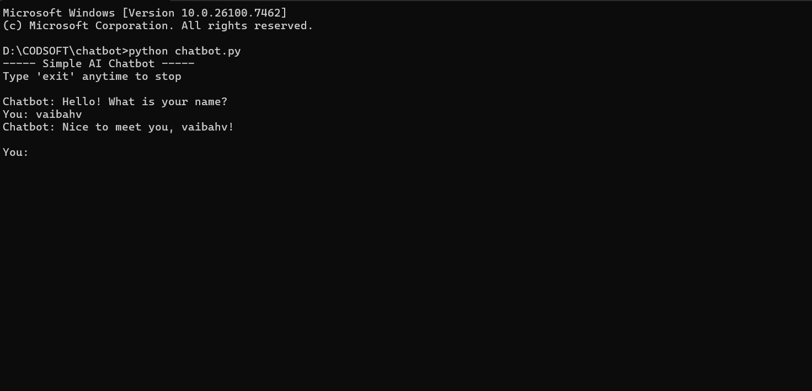

# Rule-Based Chatbot (Task 1)

This project is a **rule-based AI chatbot** developed as part of the **CODSOFT Artificial Intelligence Internship**.  
The chatbot interacts with users using predefined rules and responds based on keywords and simple logic.

---

## Description

The chatbot simulates basic conversation with a user. It can greet users, answer simple questions, perform basic arithmetic operations, and even tell jokes and motivational quotes using external text files.

This project demonstrates fundamental concepts of **Artificial Intelligence**, such as rule-based systems, input handling, and conversational flow.

---

## Features

- Greets user and remembers their name  
- Responds to common conversation inputs  
- Tells current time and date  
- Performs arithmetic operations (add, subtract, multiply, divide)  
- Tells random jokes (from `jokes.txt`)  
- Gives motivational quotes (from `motivation.txt`)  
- Handles invalid and unknown inputs gracefully  

---

## Technologies Used

- Python  
- File Handling  
- Conditional Statements (if-else)  
- Loops  
- Random Module  
- Datetime Module  

---

## Learning Outcomes

Through this project, the following concepts were learned:

- Understanding **rule-based AI systems**  
- Handling user inputs and errors  
- Using text files as a data source  
- Building conversational flow  
- Writing modular and readable Python code  

---

## Project Preview



---

## How to Run

1. Make sure Python is installed  
2. Open terminal in this folder  
3. Run the program:

```
python chatbot.py
```

---

## Author
**Vaibhav Rajendra Shinde**
