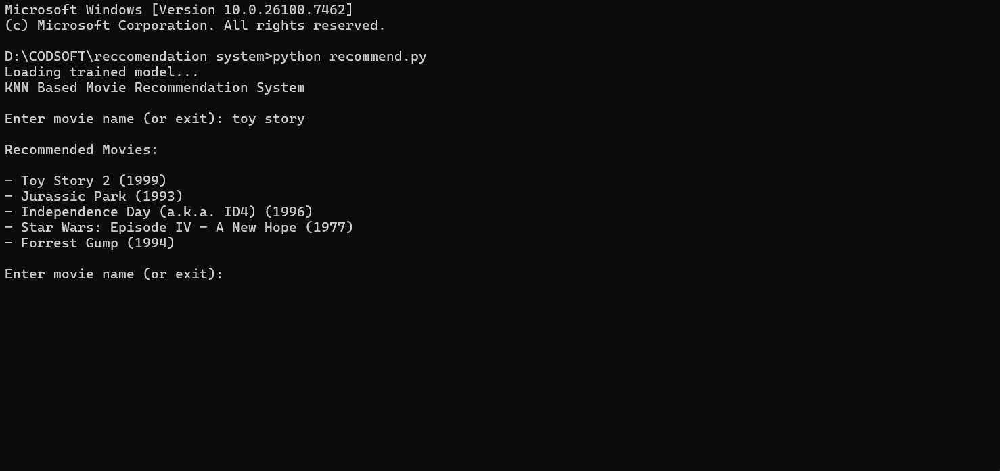

# Movie Recommendation System using KNN (Task 4)

This is a **Movie Recommendation System** developed as part of the **CODSOFT Artificial Intelligence Internship**.

The system uses the **MovieLens dataset** and the **K-Nearest Neighbors (KNN) algorithm** to recommend movies based on user rating patterns.

---

## Description

This project implements an **Item-Based Filtering** recommendation system.  
The model is trained on real user-movie ratings and finds similar movies using **KNN**.

The project is divided into two parts:

1. **Model Training** – Trains and saves the ML model  
2. **Recommendation System** – Uses the saved model to suggest movies

---

## Features

- Uses real **MovieLens dataset**  
- Implements **K-Nearest Neighbors (KNN)**  
- Item-based collaborative filtering   
- Separate training and prediction modules  
- Fast and efficient recommendations  

---

## Technologies Used

- Python  
- Pandas  
- Scikit-learn  
- KNN Algorithm  
- Sparse Matrix Representation  

---

## Learning Outcomes

Through this project, the following concepts were learned:

- Understanding **Recommendation Systems**  
- Working with real-world datasets  
- Implementing **KNN for similarity search**  
- Building a machine learning pipeline  
- Saving and loading trained models  
- Data preprocessing and matrix creation  

---

## Project Preview



## How to Run
Before running the recommendation system, you must train the model:

### Step 1 – Train the Model

```
python train_model.py
```

This creates and saves the trained KNN model.

### Step 2 – Run Recommendation System

```
python recommend.py
```

Enter a movie name to get recommendations.

---

## Project Structure

```
Task4_RecommendationSystem/
├── train_model.py
├── recommend.py
├── ratings.csv
├── movies.csv
```

---

## Author
**Vaibhav Rajendra Shinde**
